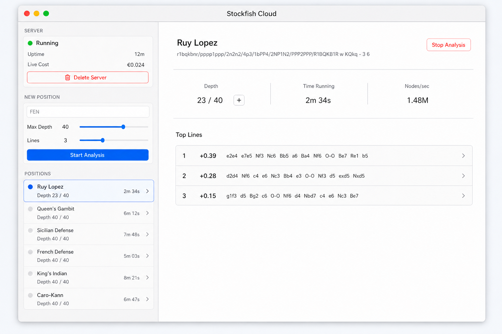

# macOS app UI reference

This is the current top-level UI reference for the planned native macOS app:

Treat this image as a wireframe-level reference for information hierarchy,
layout, and product direction. It is not pixel-perfect design guidance. When the
app is implemented, use standard SwiftUI controls, native macOS behavior, and
the repository's product constraints rather than trying to match the generated
image exactly.

Important direction captured by the mockup:

- Keep the app minimal and operational.
- Use a left pane with server status, the `New Position` form, and `Positions`.
- Use a focused detail pane for the selected position.
- Show live depth, runtime, nodes/sec, and top lines.
- Include a small `+` control next to depth to raise target depth in steps of 5.
- Do not show a board, completed badges, raw engine output, or redundant
  parameter blocks in the initial UI.
